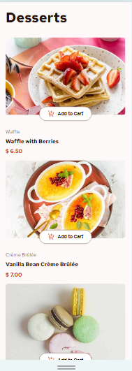
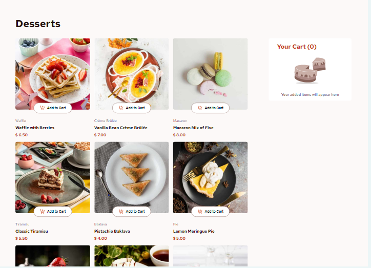

# Frontend Mentor - Product list with cart solution

This is a solution to the [Product list with cart challenge on Frontend Mentor](https://www.frontendmentor.io/challenges/product-list-with-cart-5MmqLVAp_d). Frontend Mentor challenges help you improve your coding skills by building realistic projects. 

## Table of contents

- [Overview](#overview)
  - [The challenge](#the-challenge)
  - [Screenshot](#screenshot)
  - [Links](#links)
- [My process](#my-process)
  - [Built with](#built-with)
- [Author](#author)

## Overview

### The challenge

Users should be able to:

- Add items to the cart and remove them
- Increase/decrease the number of items in the cart
- See an order confirmation modal when they click "Confirm Order"
- Reset their selections when they click "Start New Order"
- View the optimal layout for the interface depending on their device's screen size
- See hover and focus states for all interactive elements on the page

### Screenshot

### Links

- Solution URL: [Click here!](https://www.frontendmentor.io/solutions/product-list-with-cart---vuejs-pqqHl6NBkS)
- Live Site URL: [Click here!](https://arielnicolas2021.github.io/product-list-with-cart-main)

## My process

### Built with

- Semantic HTML5 markup
- CSS custom properties
- Flexbox
- Mobile-first workflow
- [Vuejs](https://vuejs.org/) - JS library

## Author

- Website - [Arielnicolas2021](https://arielnicolas2021.github.io/portfolio-2.0/)
- Frontend Mentor - [@arielnicolas2021](https://www.frontendmentor.io/profile/arielnicolas2021)
- Linkedin - [@arielaguilar2021](https://www.linkedin.com/in/arielaguilar2021/)